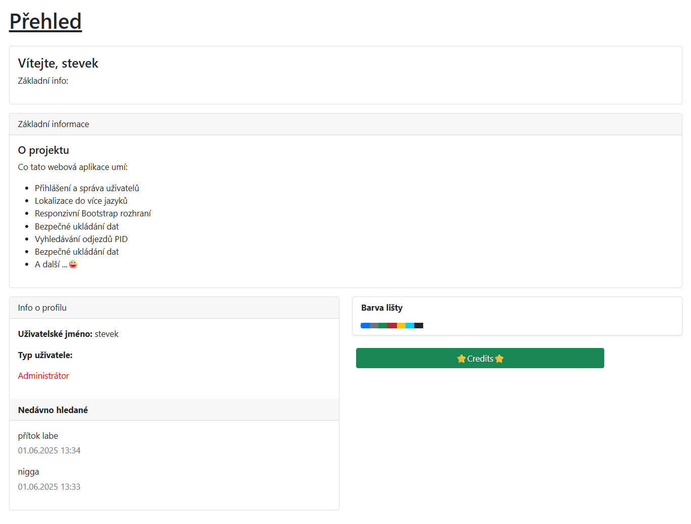
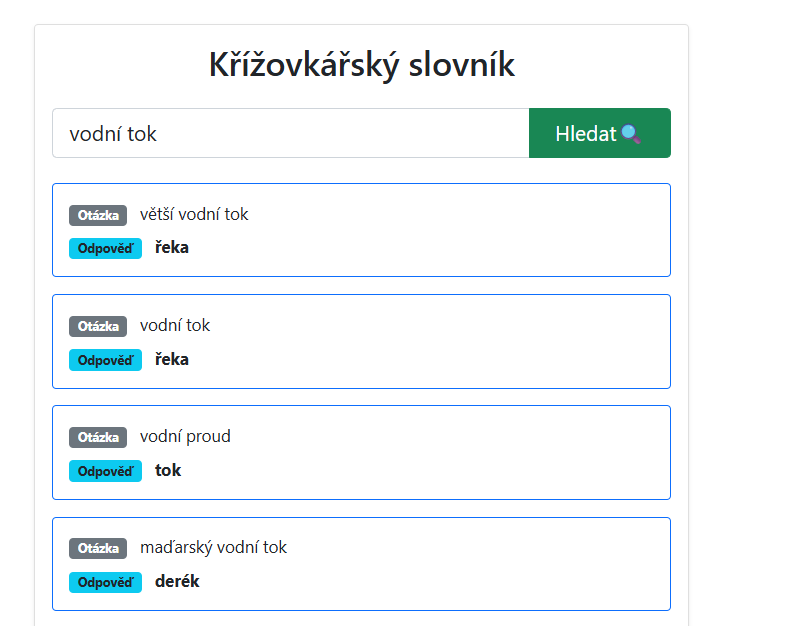
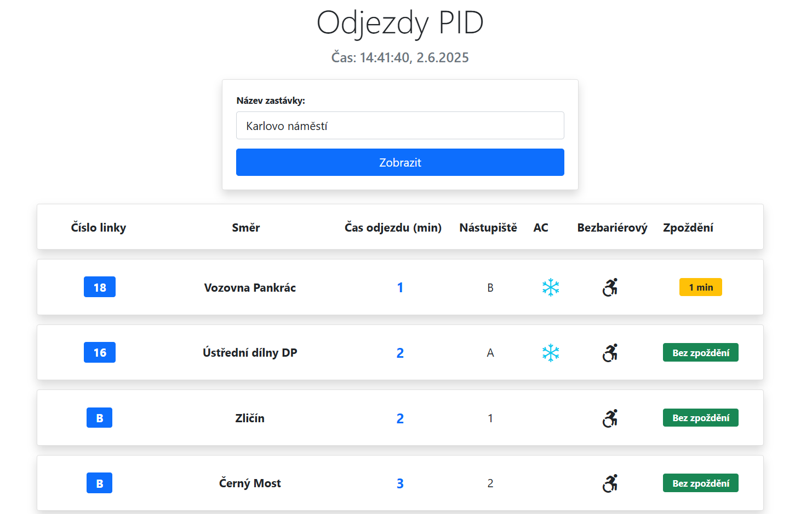

# AppCollection
Školní projekt pro 3. ročník. Obsahuje užitečné nástroje, osobní úložiště dokumentů a napojení na databázi.

## Instalace projektu:

1. Naklonujte repozitář - git clone či v IDE.
2. dotnet restore
3. databázi vytvořte a pojmenujte ProgramDataMVC.
3. dotnet ef database update - connection string v appsettings.json a musí být nainstalováno Entity Framework, pokud nefunguje použít skript create db.
5. Spustit na IIS nebo https. Vygenerujte si SSL certifikát.
6. Vytvořte si účet v aplikaci.

# Základní návod k použití

- Hlavní lišta - slouží k přepínání jednotlivých sekcí v aplikaci.
- Credits - titulky.
- Barva lišty - lze jí přepínat.
- Lze se odhlásit či si změnit jazyk na EN.

- Přehled - Info o profilu, nedávno hledané výrazy v Odjezdech PID nebo křížovkářském slovníku.

- Napíšete slovo, které chcete, a zobrazí se vám výrazy odpovídající jemu.
- Slouží k luštění švédských křížovek.

- Dokumenty:
  - Nahrávání souborů.
  - Lze si zobrazit náhled textových formátů.
  - Obrázky se zobrazí v *galerii*.
  - Skladby se zobrazí v *přehrávači skladeb*.
  - Digitálně podepsané PDF se zobrazí s ✅.
  - Každý uživatel má svoje dokumenty.
  - Heslo je zahashováno.

- Zobrazí se zde odjezdy z vybrané zastávky PID.

## Funkce

### Odjezdy PID

- Zobrazení aktuálních odjezdů pražské MHD
- Podpora všech zastávek v Praze
- Informace o zpoždění spojů
- Zobrazení nástupiště
- Doplňkové informace (klimatizace, bezbariérovost)
- Responzivní design pro mobily i počítače
- Automatická aktualizace času

### Úložiště dokumentů

- Správa osobních dokumentů.
- Bezpečné nahrávání souborů.
- Kategorizace dokumentů.
- Kontrola digitálních podpisů.

### Databázové funkce

- Napojení na SQL Server
- Perzistentní ukládání dat
- Zabezpečené zpracování dat
- Historie hledání
- Uživatelské účty

### Galerie a přehrávač skladeb
- Soubory z dokumetů se zde zobrazí, pokud tam nějaký jsou.
- Lze si přehrát audio soubory a zobrazit fotky.

### Slovní hodiny a počasí
- Zajímavý typ hodin a aktuální počasí.

### Křížovkářský slovník
- Vyhledávání slov v něm a možnost si je uložit.
### Kalendář
- Jednoduché přidávání událostí, jejich editace a mazání.
- Vytvořeno pomocí JS fullcalendar.

## Poznámka : Dokumentační komentáře vytvořeny pomocí nástroje JetBrains AI documentation comment generator.